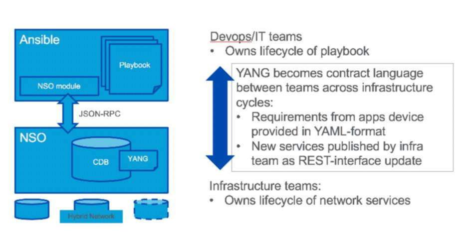
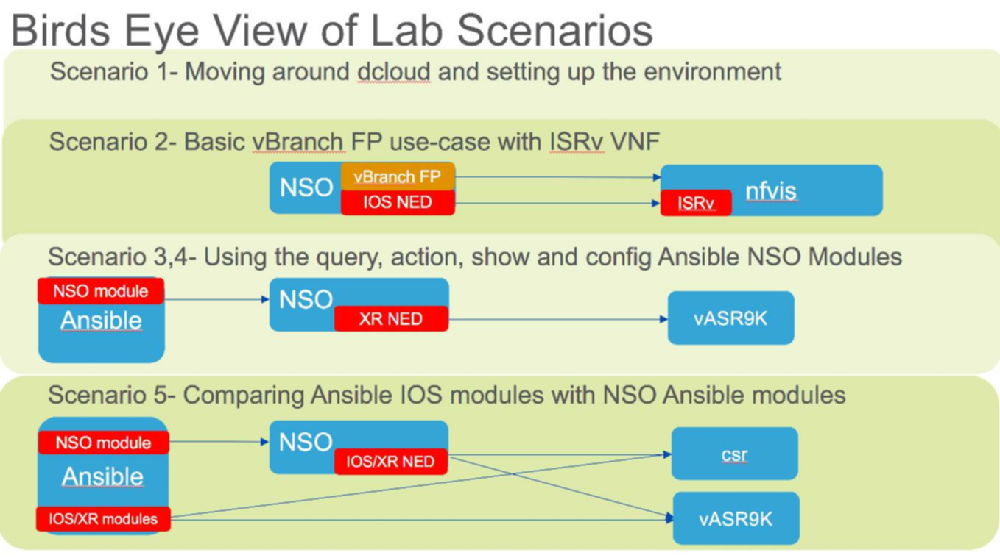
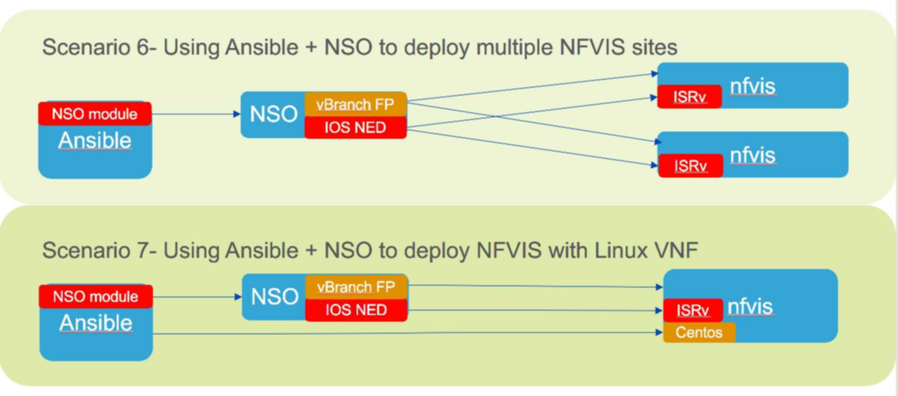

# Ansible-driven-NSO-service-automation

This repo contains sample Ansible playbooks and NSO services showing integration and use-cases between Ansible and Cisco's NSO product for driving end-to-end network services. Ansible playbooks both with and without NSO are provided such that the user can make a technical comparison of a better together solution. These playbooks are provided to demonstrate how to use the new Ansible NSO modules in order to configure IOS and IOS-XR devices and to expose the rich NSO service development capabilities for automating complex solutions, such as deploying a vBranch CPE with VNFs using the NSO vBranch Function Pack. A NSO eBGP service is used as an example. All of these NSO use cases are initiated by Ansible playbooks. A Cisco [dCloud](https://dcloud.cisco.com/) lab environment is also available along with extensive documentation. 

## Business/Technical Challenge

Given it's increasing use in server deployments, customer IT departments are Increasingly standardizing on Ansible to drive their automation needs. Ansible is a very powerful open source tool, historically focused at server and application automation. The Ansible community has recently been increasingly contributing new "module" code supporting more and more network device types. Customers are now beginning to ask why not just use Ansible for both their server/app and network automation needs. Yet, Ansible is missing critical features such as network-wide transactional support, config rollbacks, an off-net database store, and algorithms to only push needed changes. These Ansible IT customers could benefit from capabilities of both Ansible for server/app automation and Cisco's Network Service Orchestrator (NSO) for network automation.  

Customer Example:  Public Sector Customer
 
Customer's Design Goals:  Customer is looking to re-architect their global campus/WAN network as well as optimize their operations to efficiently roll out new services and configuration changes. Their design will support small, medium, and large sites, each of a “modular” and “repeatable” design.  The only variation will be in number of users supported, which will impact the choice of a small/medium/large design, driving a 1 or 2-tier topology, variation in port scale, hierarchy, etc. Services will remain identical, regardless of the size of the location. The primary transport will be IP/MPLS for WAN interconnection for any-to-any connectivity, globally. Target service offerings will include both L3 and L2 segmentation to the edge/access service delivery points. Current operations leverage basic scripting with CLI, but the customer IT team has just started to use Ansible to leverage the structured playbooks it offers and standardize on a single tool for both applications and network. Yet, the customer is seeing gaps in the Ansible solution, which are key strengths of NSO.

## Proposed Solution

NSO provides certain values not included in Ansible. These include the use of YANG for service modeling, a "network wide" commit for services that span multiple devices, auto-generation of update and delete functions, a "source of truth" network DB to only push config changes when needed, and algorithms that provide idempotent operation behavior. In order to provide a "better together" solution, the NSO team has developed "NSO modules" for Ansible such that the customer IT departments can still use their Ansible playbook approach to drive both application and network services, but via very tight integration between Ansible and NSO. 

For our customer, NSO is being investigated as the development platform for all network automation, standardizing on the APIs offered from the NSO platform rather than per-device. Moving the plan forward, the combination of using Ansible on top of NSO is the north-star plan to automate, simplify, and reduce errors in operations for any CRUD operations throughout the network, and mainly on service offering deployments, specifically targeting L2 and L3 VPN as mentioned earlier.

The authors have built sample Ansible playbooks that leverage Ansible's NSO "modules" developed by Cisco's NSO Engineering team. This integration can access sample NSO services via NSO's JSON RPC API . All playbook and NSO service code will be posted on GitHub along with a step-by-step lab guide showing how to use the Ansible NSO modules with IOS, IOS-XR and vBranch/NFVIS devices. A Cisco dCloud lab environment is also available to quickly demonstrate the use of Ansible with NSO with the Cisco ENCS/vBranch product and various VNFs.  

### Cisco Products Technologies/Services

Our solution leverages the following Cisco technologies:

* Network Service Orchestrator (NSO
* Enterprise Network Compute System (ENCS)
* ISRv/CSR1000v
* ASR9Kv

## Team Members

* John Mullooly <jmullool@cisco.com> - Americas Service Provider
* Craig Hill <crhill@cisco.com> - Public Sector 

## Solution Components

Ansible is a well known open source tool for server and application automation. Cisco has contributed NSO modules to Ansible such that Ansible playbooks can now be developed to drive NSO device and service configuration. The API used to communicate to NSO is a JSON RPC. Any device or service in NSO can now be accessed via Ansible. In our labs we run through several examples:

* Using the query, action, and show Ansible NSO Modules
* Using the Ansible config Module
* Comparing Native IOS Ansible modules with NSO Ansible Modules
* Ansible + NSO deploying multiple NFVIS/vBranch sites
* Ansible + NSO deploying NFVIS/vBranch with Linux VNF

The code for this project includes:

* Anible playbook creation
* NSO eBGP XPATH service creation
* Creating deployment XML files for NSO
* Building proper Day0 bootstrap files for both ISRv and CentOS VNFs

## Usage

The below referenced documentation in the [docs folder](./doc) reviews all usage guidelines. As an example, the user will execute an Ansible playbook from the command line, which will then pull in any required variables from the vars.yaml and hosts files. Here is a sample execution of the query-hostname-xrv.yaml playbook in single verbose (-v) mode. The playbook uses the nso_query module to pull hostname data from NSO via the XPATH to the target host. The "target" is a variable which is referenced in the vars.yaml file and set to the XRV1 host.

[root@ansible NSO-Playbooks]# ansible-playbook query-hostname-xrv.yaml -v

Using /root/playbooks/NSO-Playbooks/ansible.cfg as config file

PLAY [Query hostname on XRv] ************************************************************************************************************************************************************

TASK [Query hostname] *******************************************************************************************************************************************************************
ok: [localhost] => {"changed": false, "output": [["xrv9k"]]}

PLAY RECAP ******************************************************************************************************************************************************************************
localhost                  : ok=1    changed=0    unreachable=0    failed=0 

## Installation

The easiest approach is to utilize the pre-canned Cisco dCloud environment, which has all components including the IOS, IOS-XR and ENCS devices. This will be generally available in the dCloud catalog (going through QA now) in mid-February 2019 but can be requested before then by sending an email to <jmullool@cisco.com>. 

Otherwise, for manual install, you need to:

* Install Ansible- [Link to Ansible](https://docs.ansible.com/ansible/latest/installation_guide/intro_installation.html)
* Install Cisco NSO- [Link to NSO](https://developer.cisco.com/docs/nso/#!getting-nso/getting-nso)
* Install the Cisco NSO vBranch Function Pack if interested in vBranch use cases
* Have IOS, IOS-XR, ENCS devices available to configure

## Documentation

Complete lab guide material can be found here:
[vBranch_and_Ansible_Lab_v01_26_19.docx](https://github.com/jmullool/Ansible-driven-NSO-service-automation/blob/master/doc/vBranch_and_Ansible_Lab_v01_26_19.docx)

## License

Provided under Cisco Sample Code License, for details see [LICENSE](./LICENSE)

## Code of Conduct

Our code of conduct is available [here](./CODE_OF_CONDUCT.md)

## Contributing

See our contributing guidelines [here](./CONTRIBUTING.md)
